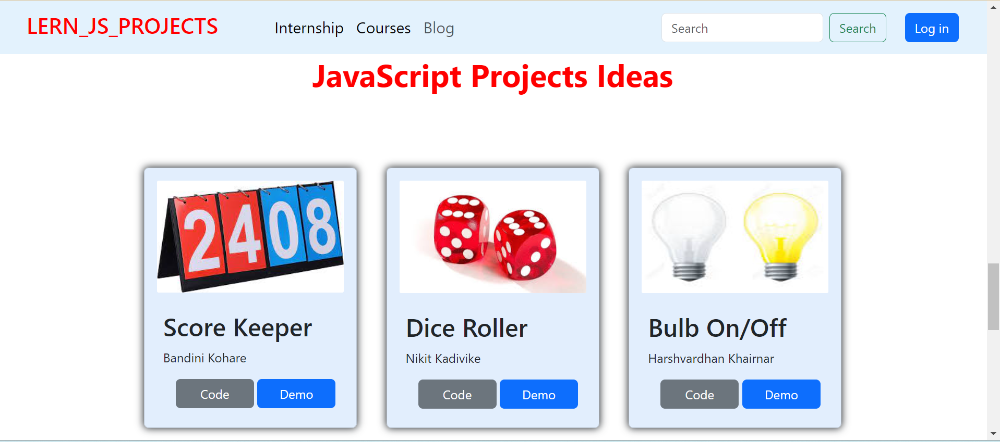

# JS-project
**Homepage**
 

**Project cards**
 

**Advertisement**
 

## Description
Introducing our rapid one-day JavaScript project: "Learn JS Projects." This platform is your gateway to swift coding success! We've taken the complexity out of coding and brought you a range of easy-to-grasp projects that'll have you learning JavaScript in no time
 

## Contributors 👏

